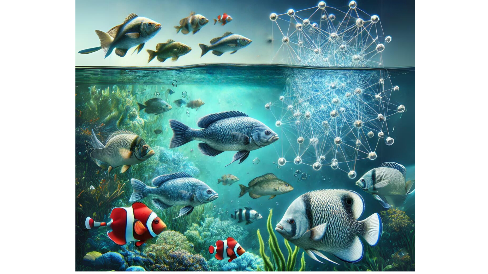

# 🥇 Birinci Olan Projem - Akbank Derin Ögrenme Proje Kampı

  
    <h1><b>🎣 Balık Görüntü Sınıflandırması: Yapay Sinir Ağı (ANN) Yaklaşımı</b></h1>
  

<h3 style="color: #2c3e50; font-family: Verdana, sans-serif;">📑 İçindekiler</h3>
<ul style="background-color: #f9f9f9; padding: 15px; border-radius: 10px; font-family: 'Segoe UI', sans-serif; list-style-type: square;">
  <li>Proje Özeti</li>
  <li>Veri Seti</li>
  <li>Projenin Amacı</li>
  <li>Model Yapısı</li>
  <li>Hiperparametre Optimizasyonu</li>
  <li>Test Veri Seti Sonuçlar</li>
  <li>Gelecek Çalışmalar</li>
  <li>Kaggle Proje Linki</li>
  <li>Proje Çözüm Webinar Youtube Linki</li>
</ul>

<h3 style="color: #2c3e50; font-family: Verdana, sans-serif;">Proje Özeti</h3>

Bu proje, İzmir'deki bir süpermarketten toplanan görüntüler kullanılarak 9 farklı deniz ürünü türünün sınıflandırılmasını hedeflemektedir. Veri seti, İzmir Ekonomi Üniversitesi ve bir sanayi kuruluşunun iş birliğiyle yürütülen üniversite-sanayi ortaklık projesi kapsamında toplanmış olup, 2020 yılında ASYU'da yayınlanmıştır. Balık türlerinin sınıflandırılması için yaygın olarak Convolutional Neural Network (CNN) kullanılsa da, bu projede sadece Yapay Sinir Ağı (ANN) kullanılmıştır.

<h3 style="color: #2c3e50; font-family: Verdana, sans-serif;">🛢️ Veri Seti  </h3>

Veri seti aşağıdaki balık türlerine ait görüntüleri içermektedir:

<ul style="background-color: #f9f9f9; padding: 10px; border-radius: 10px; font-family: 'Segoe UI', sans-serif; list-style-type: circle;">
  <li>Gilt Head Bream</li>
  <li>Red Sea Bream</li>
  <li>Sea Bass</li>
  <li>Red Mullet</li>
  <li>Horse Mackerel</li>
  <li>Black Sea Sprat</li>
  <li>Striped Red Mullet</li>
  <li>Trout</li>
  <li>Shrimp</li>
</ul>

Her balık türüne ait 1.000 görüntü bulunmaktadır. Bu nedenle veri seti dengelidir ve toplamda 9.000 görüntüden oluşmaktadır.

<h3 style="color: #2c3e50; font-family: Verdana, sans-serif;">🎯 Projenin Amacı</h3>

Bu projenin amacı, ANN kullanarak balık türlerini doğru şekilde sınıflandırmak ve modelin genelleme kabiliyetini artırmaktır. Genelleme kabiliyeti, modelin daha önce görmediği yeni verileri doğru şekilde tahmin edebilme yeteneğidir. Ancak, aşırı öğrenme (overfitting) bu kabiliyeti engelleyebilir. Bu sorunu aşmak için early stopping ve dropout gibi yöntemler kullanılmıştır. Ek olarak, hiperparametre optimizasyonu yapılmıştır.

<h3 style="color: #2c3e50; font-family: Verdana, sans-serif;">Model Yapısı</h3>

Bu projede, CNN yerine ANN kullanılmıştır. Görüntüler doğrudan ANN'e verilmiş ve özellik çıkarımı aşaması olmadan balık türlerinin doğru şekilde sınıflandırılması sağlanmıştır. Modelin genel yapısı şu şekildedir:

<ul style="background-color: #f9f9f9; padding: 10px; border-radius: 10px; font-family: 'Segoe UI', sans-serif; list-style-type: disc;">
  <li>Girdi Katmanı: Görüntü pikselleri doğrudan ANN'e beslenir.</li>
  <li>Yoğun Katmanlar (Dense Layers): Tam bağlı katmanlar sınıflandırma işlemini yapar.</li>
  <li>Çıktı Katmanı: Softmax aktivasyon fonksiyonu ile çoklu sınıf sınıflandırması yapılır.</li>
</ul>

<h3 style="color: #2c3e50; font-family: Verdana, sans-serif;">🚀 Hiperparametre Optimizasyonu</h3>

Modelin performansını artırmak ve aşırı öğrenmeyi engellemek amacıyla Random Search yöntemiyle hiperparametre optimizasyonu yapılmıştır. Random Search, hiperparametre uzayından rastgele örnekler seçerek arama yapar. Bu yöntem, arama uzayının büyük olduğu durumlarda daha hızlı sonuç alınmasını sağlar, ancak optimum hiperparametre kombinasyonunu bulmak her zaman garanti değildir.

<h4 style="color: #2c3e50; font-family: Verdana, sans-serif;">Alternatif Yöntemler:</h4>
<ul style="background-color: #f9f9f9; padding: 10px; border-radius: 10px; font-family: 'Segoe UI', sans-serif; list-style-type: square;">
  <li>Grid Search: Hiperparametre kombinasyonlarının tamamı taranarak en iyi sonuca ulaşılır, fakat çok fazla hesaplama gücü ve zaman gerektirir.</li>
  <li>Bayesian Optimization: Daha az denemeyle optimum sonuca ulaşabilir ve zaman tasarrufu sağlar. Ancak, çok büyük arama uzaylarında yine de uzun sürebilir.</li>
</ul>

📌 Yapılan hiperparametre aramaları sonucunda modelde belirgin bir iyileşme gözlenmemiştir, bu durum Random Search’ün rastgele seçimler yapmasından ve bu projede uygulanan hyperparameter uzayımızın dar tutulmasından(süre gereği) kaynaklanmaktadır.

<h3 style="color: #2c3e50; font-family: Verdana, sans-serif;">Test Veri Seti Sonuçlar</h3>
<ul style="background-color: #f9f9f9; padding: 10px; border-radius: 10px; font-family: 'Segoe UI', sans-serif; list-style-type: square;">
  <li>Test Loss: 0.066 </li>
  <li>Test Accuracy: 0.98 </li>
</ul>

Model, test veri seti üzerinde iyi bir performans göstermiştir. Aşırı öğrenme engellenmiş ve genel olarak güçlü bir model elde edilmiştir.

<h3 style="color: #2c3e50; font-family: Verdana, sans-serif;">👩‍💻 Gelecek Çalışmalar </h3>
<ul style="background-color: #f9f9f9; padding: 10px; border-radius: 10px; font-family: 'Segoe UI', sans-serif; list-style-type: square;">
  <li>Özellik çıkarımı için CNN'leri deneyerek performans karşılaştırması yapılabilir.</li>
  <li>Daha gelişmiş hiperparametre optimizasyon yöntemleri (örneğin, Bayesian Optimization) uygulanabilir.</li>
  <li>Veri çoğaltma (data augmentation) teknikleri kullanılarak veri seti çeşitlendirilebilir.</li>
</ul>

<h3 style="color: #2c3e50; font-family: Verdana, sans-serif;"> 🔗 Kaggle Proje Linki</h3>

Projenin Kaggle sayfasına ulaşmak için şu bağlantıyı kullanabilirsiniz: <a href="https://www.kaggle.com/code/duygukranolu/fish-classification-ann" style="color: #00b7eb; text-decoration: none;"> https://www.kaggle.com/code/duygukranolu/fish-classification-ann </a>

<h3 style="color: #2c3e50; font-family: Verdana, sans-serif;"> 🔗 Proje Çözüm Webinar Youtube Linki</h3>

Proje Çözüm Webinar Youtube sayfasına ulaşmak için şu bağlantıyı kullanabilirsiniz: <a href="https://www.youtube.com/watch?v=gjB1fFFLWKM&t=69s" style="color: #00b7eb; text-decoration: none;"> https://www.youtube.com/watch?v=gjB1fFFLWKM&t=69s </a>

